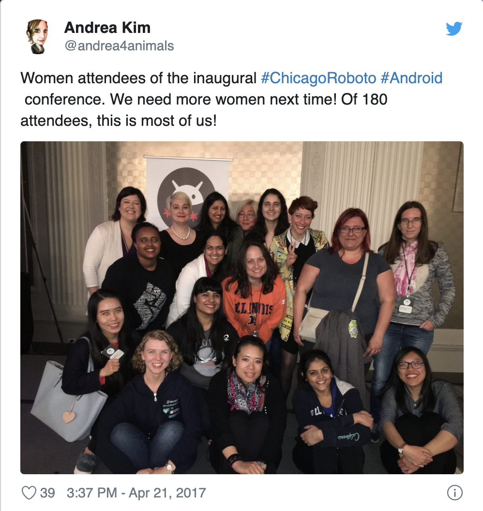
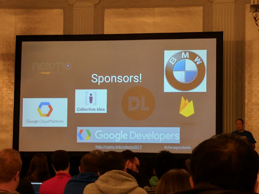

# \#WhereInTheWorldIsVictoria
## My review of Chicago Roboto 2017
This year I had the opportunity to attend (and keynote!) [Chicago Roboto](http://chicagoroboto.com/)). It was great to have an Android conference in Chicago. I grew up in the area, and was more than excited to be back. It was the second conference I went to in April, and was the perfect way to wrap up my travels.

The conference started off with a great [keynote](https://speakerdeck.com/jakewharton/death-taxes-and-http-chicago-roboto-2017-keynote) by [Jake Wharton](https://twitter.com/JakeWharton) and [Jessie Wilson](https://twitter.com/jessewilson) about how HTTP works. We are often concerned about the client side, or server side, but not too much about how they communicate. They provided an understandable description of this middle bit of our work, and how it affects the speed of our applications.

There were so many other great talks at the conference as well. It's difficult to pick only a couple to talk about. [Mallika Potter](https://twitter.com/mallikaandroid) encouraged us to make our apps [accessible](https://speakerdeck.com/mallikapotter/accessibility-at-scale) to the 1 in 5 people in the US with a disability. I [learned](https://speakerdeck.com/maltzj/multiplying-your-impact-through-mentoring-chicago-roboto-2017) a bunch from [Jonathan Maltz](https://twitter.com/maltzj) about what it takes to be a great mentor. [Huyen Tue Dao](https://twitter.com/queencodemonkey) also got me really excited to try out [Constraint Layout](https://twitter.com/queencodemonkey/status/855448112743284738). These are only a few of my favorites, and I encourage you to check out the videos.

While there, I was also able to give [my talk](https://vimeo.com/217569130) about decompiling Kotlin as the day 2 keynote. In it, I showed how decompiling Kotlin bytecode into Java can help inform us about how Kotlin works.

The community of the conference was also a great one to walk into. There was about 180 attendees, which was a great size to get to really know your fellow conference attendees. As with many tech conferences, there was a minority of women, but those of us who were there were able to join together as a strong representation.

_[https://twitter.com/andrea4animals/status/855536046737674244](https://twitter.com/andrea4animals/status/855536046737674244?s=20)_

Of course, what is a conference without stickers! I brought Kotlin and Collective Idea stickers with me to share. We had a fun time searching for our favorite stickers.

 _[https://twitter.com/rharter/status/855179696413315073](https://twitter.com/rharter/status/855179696413315073?s=20)_

One thing I enjoyed about the conference is their dedication to the community. To be able to reach out into Chicago, and not just huddle in the conference center was through the use of lunch vouchers. Instead of having lunch catered, we had vouchers to some local restaurants in the area. This allowed a distribution of the conference's impact, and gave the attendees and opportunity to explore more of the city. I was able to visit the office of some fellow attendees as well because of this.

[Collective Idea](https://collectiveidea.com/) was a supporting sponsor of the event, and I'm proud of it. Chicago Roboto is just getting started, and I'm excited to see where it goes. I hope to see you there next year!

_05/12/2017_
