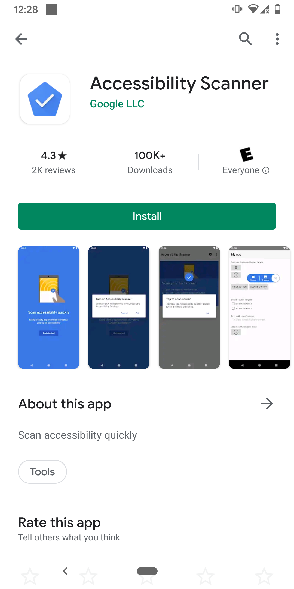
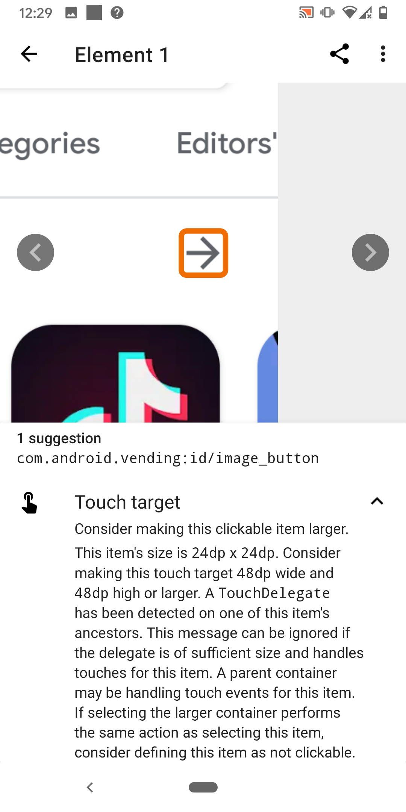
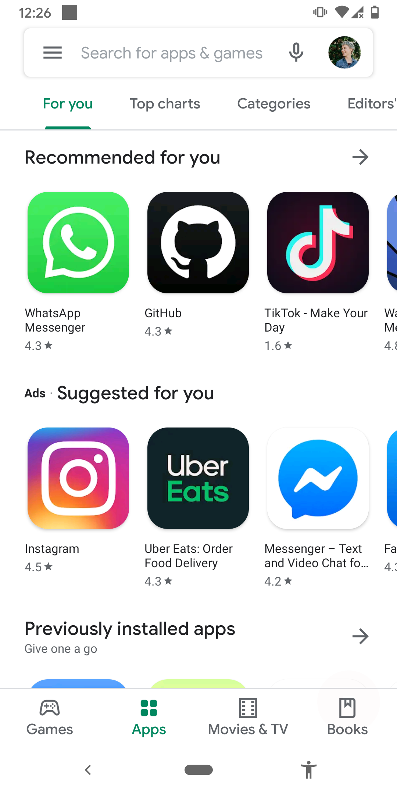

Footer: @TTGonda
## Increase Your Product Quality Through Accessibility
### **_Victoria Gonda_**
#### _@TTGonda_ _∙ victoriagonda.com_

---

# Go to **menti.com**

^ We will create a word cloud together
- This is only available live

---

# What is **accessibility**?

^ A lot of things. In short, it's a way to make your app available to use by more people.
- This is largely thought about when it comes to supporting people with disabilities
    - Vision, hearing, motor
    - Cognitive, mental health disorders

---

# Why should **you** care?

^ Lots of reasons ->
- From product to personal to legal

---

## Makes a better product
### _A product that is created with accessibility in mind provides a better experience for_ **_everyone._**

^Examples:
- Temporary disabilities
    - Driving
    - Broken wrist
    - Eyes dilated
- Keyboard nav (esc to close modal, enter to submit form, tab to advance to next form field)
- Captions on videos
- Customization (dark mode, audio settings)
- Phone vibration
- More consistent and predictable layouts

---

## Wider audience

### **_1 in 4_** _adults in the US have some type of disability_

^People with disabilities represent the largest minority group
- According to the CDC, 1 in 4 adults in the US have some type of disability
- By catering to this group, you have access to a larger user base

^ https://www.cdc.gov/ncbddd/disabilityandhealth/infographic-disability-impacts-all.html

---

## Drive innovation
### _Constraints are fuel for_ **_creativity_**

^ Creating apps for accessibility does mean working within constraints
- Maybe you can't fit as much content on the screen
- This means you have to really think about what's important and where it's located, making it a better experience for everyone

---

## Legal reasons
### **_ADA_** _Compliance_

^ Support accessibility guidelines _before_ there's a lawsuit

---

## Treat your users with care

### _Let’s change the narrative “heroic disabled person overcomes obstacles” to_ **_“society is inclusive, all can succeed.”_** - Haben Girma

^ Because it's the right thing to do.
- We want to be an inclusive society that takes care of our neighbors
- Imagine being under shelter-in-place and not being able to order food because the app isn't assessable for you

---

# Quiz time!

^ I'm not showing the leaderboard, so no one will see who answered what.
- Question: Who can test for accessibility improvements?
- Answer: Anyone who is willing to

---

# Accessibility tools

- _Screen reader_
- _Display size and font size_
- _Color changes_

---

# Accessibility testing
- _Manual/user testing_
- _Accessibility Scanner/Axe_
- _Automated tests_
- _Lint checks_

---

^Example of a scanner app
- Similar error Brought up by e2e testing

---

### _WGAC_
## Dimensions of **accessibility**
#### Perceivable, Operable, Understandable, Robust

^ According to Web Content Accessibility Guidelines (WCAG) 2.1
- We don't have time to go over EVERYTHING, but will hit some of the quickest ways to support accessibility. 
- Thing of it as a sample platter
- The goal is that when you're making a product decision you can think back and remember "I think there was an accessibility argument for that. Let me remind myself before deciding"
- WGAC uses 4 categories to organize the guidelines
- We'll describe what these dimensions are, then dig a little deeper into how you can support them

---

## Perceivable

###**_"Information and user interface components must be presentable to users in ways they can perceive."_**

^This requires thinking about ways that people can consume content.
- Can everything on your screen be read with a screen reader?
- If there's an audio cue, is there another way to receive the cue?

---

# Quiz time!

^There are lots of correct answers to this one and it would only let me put in 5. You all have great answers
Question: What is a way people can perceive your app? (example: audio)
Answers: sight, color, audio, touch, shape

---

# Labeling

Images and image buttons

- _Make sure they have a description. `contentDescription` for Android and `accessibilityLabel` on iOS._

Inputs

- _Make sure inputs are clearly labeled with what they are for._

^The purpose of this one is for people using screen readers
- This is especially for images and buttons without readable text.
- Otherwise the screen reader would say something like "Unlabeled button"
- The user might not _perceive_ what the button is supposed to do in that case!
- One exception is if the image doesn't need to be perceived to operate your app, like a decoration. In that case you should set it such that the screen reader knows it can skip it.

---

# Time based media

Audio, video, and auto advance

- _Provide alternatives, or_
- _Make them optional_

^Not everyone can watch videos or listen to audio
- If you have an on boarding tutorial video, is there text to go with it? Maybe captions?
- Does your app use audio cues?
- Imagine downloading a new app and not being able to get past on boarding because you can't access the instructions in a way you can perceive.

---

# Time based media

Audio, video, and auto advance

- _Provide alternatives, or_
- _Make them optional_

Also

- _Allow rewinding and skipping_

^This is for a variety of reasons
- The movement of a video could cause nausea for some
- It could cause others anxiety if they feel they missed something and can't go back
- People with motor or cognitive disabilities might need more time
- It can also be anxiety inducing if there's limited time to absorb some bit of information
- Finally, motion and animation could be distracting for some about detract from what you're trying to communicate.

---

# Relationship and ordering

- _Arrange the items on the screen in an order that makes sense_
- _Group items together_

^Most screen readers will traverse the screen top/start to bottom/end.
- This also happens to be the way most humans consume content
- You also want to group things together that should be read at the same time, such as a label and value

---

# Sensory cues

Don't rely on only a visual or audio cue to convey information

- _This includes things like shape, color, size, visual location, orientation, or sound_

^If you're trying to communicate something to your user, don't rely on only these things because they might not be perceivable
- An example might be when an error pops up on the screen. Does someone who's using a screen reader know that there's a new error?

---

# Orientation

Allow both portrait and landscape

- _Yes, this might mean designing for both screen layouts_

^There are some exceptions, but support both where you can
- Imaging having low mobility and having your screen on a mount on your wheelchair. It's not easy, or in some cases possible, to change the orientation of the device in order to use the app.

---

# Color

Color contrast

- _Make sure you have adequate color contrast on words and buttons_

^Any text that needs to be distinguishable needs to have a contrast of 7:1 for most text and 4.5:1 for large text
- Exceptions include things like decorations or logos
- There are similar contrast rules for other controls like buttons that need to be perceivable

---

# Color

Color contrast

- _Make sure you have adequate color contrast on words and buttons_

Conveying information

- _Don't use color for the only visual means of conveying information_

^Similar to audio and other visual cues, it shouldn't be the only way you communicate something
- For example, don't only use red and green to show something is a success or failure. You should also use something like icons or text in case the colors aren't perceptible.
- I have an app that uses color as one way to show if an answer is right or wrong
- I also use digital wellbeing to make my phone grayscale after a certain time at night
- This app becomes harder to use after that time.

---

# Font and display size

- _Your app should still be usable with large sizes_

^If someone has the font size bumped way up, you should still be able to use your app like normal
- One of the easiest ways to violate this is if you assume a text view will always be under a certain width or height
- In the case of when text views are next to each other, constrain layout flows can help bump a view to the next line if needed

---

^As a side by side

---

## Operable

###**_"User interface components and navigation must be operable."_**

^Can you navigate and perform actions with a keyboard or talkback
- Are buttons big enough to press?

---

# Quiz time!

^There are lots of correct answers to this one and it would only let me put in 5. You all have great answers
Question: What is a way people can operate your app (example: touch screen)
Answers: touch screen, gestures, audio, switch

---

# Navigation

- _Can everything be reached using a screen reader?_
- _Does the order make sense?_
- _And is the meaning clear?_

^One of the best ways to understand this is to try it out yourself or watch someone try it out
- As you walk through the screen, can you reach everything that's on it?
- Does it make logical order? An example of something that wouldn't make logical sense is to have a summit button at the top of a page rather than at the end of a form.
- Are things grouped in a way that makes sense? Is something repetitive?
- And if the user reaches a button on the screen, is it clear what action it performs
- More than just for screen reader. It can cause anxiety for your user if they don't know what will happen when they press a button.

---

# Timing

Give users enough time to complete a task

_Allow extending time if needed, or don't put time limits at all_

^This one applies for so many reasons
- If something is showing and hiding, someone who is slower at consuming the information might miss it
- And a similar argument for those with motor restrictions
- It's also better for users with anxiety to not have those time limits to contribute to any anxious feelings
- There are exceptions for this one. For example, if something goes out of stock or it's a time based game
- Another thing to note around timing is that you should avoid flashing things, both because of seizers and because things are harder to perceive while flashing

---

# Gestures and Pointers

Multi-touch gesture actions should be accessible via a single touch

_And you should be able to back out of single touch ones, too_

^This covers things that might take multiple fingers, like pinch to zoom out
- In case someone isn't able to pinch for one reason or another, there should be another way to accomplish the task. An idea of an additional way to access the functionality in this case might be a slider
- And for single touch actions, there should be a way to back out or undo. This might be if you move your finger off of the button before you lift up, the action isn't performed (default), or having an "undo" or "back" option.

---

# Touch targets

- _Make sure items are large enough to interact with_

^Have you ever visited a website, or even an app, on your phone and struggled to click on a link or button that was just too small?
- The recommended size for Android is 48dpx48dp for anything clickable or intractable
- Also makes the actions in your app more clear

---

## Understandable

###**_"Information and the operation of user interface must be understandable."_**

^Not only can your content be perceived, but can it be understood
- Includes things like limiting abbreviations and idioms
- Is it clear why something error?
- I understand all those words separately

---

# Language!

- _Internationalization_
- _Unusual words and idioms_
- _Abbreviations_

^Internationalizing and localizing, which can be a whole talk in itself, your app is part of this, but not the only way to make your app more understandable.
- You can also avoid hard to read words and idioms which are usually culturally specific.
- Avoiding long blocks of text improve the experience for everyone (who actually reads it, anyway) and makes for a better experience for users with autism. You want your content to be easily digestible.
- How many times have you run into an abbreviation you don't know and felt old or awkward because you had to look it up? Don't do that to your users!
- The same can also go for emojis and icons. Symbols don't always mean the same thing to everyone.
- On the flip side, pairing icons with text can help improve understandability. Some people comprehend words better, and for some images are easier

---

# Consistency

- _Labeling_
- _Ordering_
- _Context_

^You want things to be consistent for everyone. Are you using "Send" or "Submit" throughout the app?
- It also pays to have a consistent layout and ordering throughout the app. It makes the app much easier to navigate for everyone. This is especially true for people using screen readers, and users with autism.
- Finally, you don't want the context of where you are in the app to change unless an action is performed to cause that change, such as pressing a button. This brings down confusion of "Where am I and how did I get here?"
- A mini version of this would be if you click into an in put field and the hint or label goes away. What if the user gets pulled away and when they come back it's unclear to them what they're supposed to type in?

---

## Robust

###**_"Content must be robust enough that it can be interpreted by by a wide variety of user agents, including assistive technologies."_**

^If you're using native components this is taken care of for you.
- So we won't spend extra time on it.
- This is something to look into if you have highly customizable and interactive views, like drawing on a canvas
- Make sure your custom view is hooked into the accessibility services correctly
- One note I will put here is that the more configurable you make your app, the more accessible it will be. Be it for color schemes, audio settings, animations, and more. Everyone, regardless of ability, has different needs and preferences. If you let others use the app in the way that's best for them, it will mean a more quality product.

---

## Build quality apps. **Build for the world you want.**

^In the end, build quality apps because you care about having a quality app.
- Build accessible apps for the caring world you want to live in
- Thanks for listening!
- I'm here for questions as long as the video call is open, and available online after that
- You can find me on twitter @TTGonda. I'm also on linkedIn if that's more your thing.
- These slides and all my resources can be found on my website victoriagonda.com

---

## **Word cloud**: What things can you remember to look for to keep your app accessible?

---

## Thank you
### **_Victoria Gonda_**
#### Resources: VictoriaGonda.com/talks
