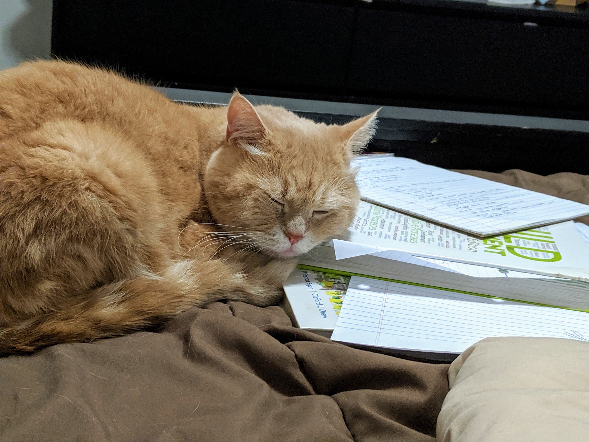
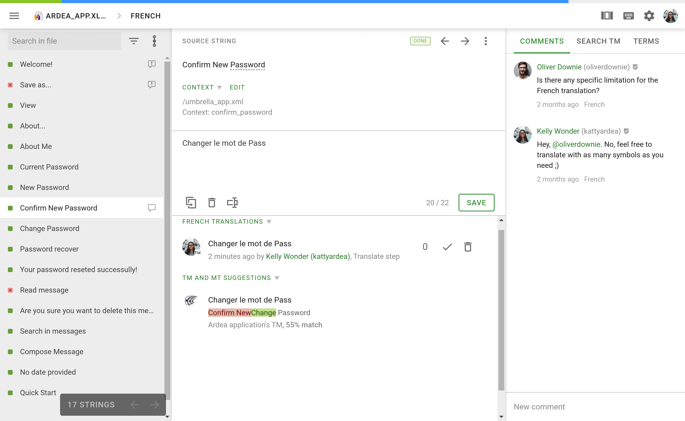
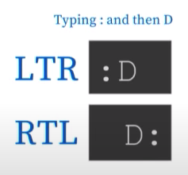

footer: @TTGonda | victoriagonda.com

## **Internationalization-ing**
### Victoria Gonda


^Notes
- Thanks orgs and sponsors
- Software eng in Chicago
- Mostly Android
- Author of ATDD (and soon a11y)
- Pets!
- Resources on website

## **What is Internationalization?**


^Notes
- Why I'm interested in i18n
    - Effort to translate Buffer app
    - Related to a11y
    - I find it interesting

## i18n

^Notes
- The process of getting your app ready for other locales
- "Internationalization (I18n) means structuring applications in a way that makes it possible for them to be localized."
    - Source: http://apiux.com/2013/04/25/how-to-localize-your-api/

## Localization (l10n)

^Notes
- Prepping your app for a specific locale, like Spanish speaking Americans
- Localization (L10n) means making an application work for a particular market, such as French-speaking Canadians.
    - Source: http://apiux.com/2013/04/25/how-to-localize-your-api/

## Support Right-to-Left (RTL)

^Notes
- This is more than just text. It also includes layouts and icons
- We'll look at this deeper later in the presentation

## Use mindful abbreviations and formats

## Watch iconography semantics

## **Why Internationalize Your App**



## Makes the product accessible to more people

## Makes it more comfortable for others

## Makes a higher quality app

^Notes
- More intention
- Think about semantics
- RTL and longer text can highlight bad UI

## Saves time later

^Notes
- If you set your app up for i18n ahead of time, it's after to add it later

# **Localization**


# Localization

-   Often the most obvious part of i18n
-   Requires each of your user facing strings are referenced from a string resources file
-   Then there are alternates for each of these strings for each language you support
-   NO raw user facing strings in your code

# Android

_values/strings.xml_
```
<string name="greeting">Hello, %s</string>
```

_values-es/strings.xml_
```
<string name="greeting">Hola, %s</string>
```

^Notes
- You can specify not only language, but also country

# Android

```
context.getString(R.string.greeting)
```

OR

```
<TextView android:text="@string/greeting" />
```

# react-localization[^1]


```
let strings = new LocalizedStrings({
 en:{
   greeting:"Hello, {0}"
 },
 es: {
   greeting:"Hola, {0}"
 }
});
```

[^1]: https://www.npmjs.com/package/react-localization

# react-localization[^1]

```
<Text>
  {strings.greeting}
</Text>
```

# Translating

-   Internal
-   Open source
-   Service

# Localization Tools


^Notes
-   And many other services
-   Manage translations across languages and platforms
-   See translation progress
-   Get translation services

---



---


^Notes
-   Don't assume text length
-   Translated text is some languages can be much longer than the language you're testing in
-   By not having flexible text view sizes, text can be cut off
-   Both length and new lines
-   Also keep in mind that some languages have words that can get longer when truncated
-   By making these flexible, you also better support text scaling for accessibility

# Localization with an API

-   Set language from device or let user pick
-   Inform API of language.
-   Use that language to fetch from your translation file

^Notes
-   Can use HTTP headers recommended
    -   Accept-Language and Content-Language headers already exist
-   Can also use queries or a setting on the user's account

^Source: http://apiux.com/2013/04/25/how-to-localize-your-api/

# Locale safe text manipulation

`"TITLE".toLowerCase()` -> "title" in English

`"TITLE".toLowerCase()` -> "tıtle" in Turkish

^Notes
- Some languages don't user upper or lower case letters

# **Abbreviations and Formats**


## Not everyone uses and knows the same abbreviations

## Avoid idioms

^Notes
- And watch for cultural norms

## People prefer different formats

^Notes
- Date
- Time
- Calendars
- Start of week
- Addresses
- Names
   - When possible, avoid first/last and length of names

## Display the user's currency

^Notes
- If you can display something in a user's currency the message is understood better

# **Right-To-Left**


^Notes
-   RTL mental modal. Start/end back/forward, etc
-   More generic UI. Points out bad UI design "Left" vs "Back" 

## Support right aligned text

^Notes
- If you also support user generated content, be prepared to isolate it and support a mix of both RTL and LTR

## Bi-Directional Isolation tag[^2]

`User <bdi>إيان</bdi>: 90 points`

[^2]: https://www.w3schools.com/tags/tag_bdi.asp

^Notes
- Isolates text that might have different directionality than the surrounding context so it's treated more correctly.
- Helpful when you're inserting user content

## Also reverse parts of layouts and breadcrumbs
## Use start/end over left/right

^Notes
- Use start/end over left/right when your framework supports it

## Reverse directional icons and icons showing text direction

^Notes
-Reverse directional icons and icons showing text direction

# Try it out

-   Chrome: [chrome://flags/#force-ui-direction](chrome://flags/#force-ui-direction)
-   Android: Developer settings


# RTL emoticon example[^3]



[^3]: https://youtu.be/xpumLsaAWGw

---

**"Wait, it does ??tahW: How supporting Right-to-Left can expose your bad UX" by Moriel Schottlender[^3]**


# **Iconography Semantics**


## Use icon meaning

^Notes
- "Back" button vs "left" button

## Symbols might not mean the same thing in all cultures 🙏

## Watch for icons with currency and letters

# Testing

-   Change language in browser or on device
-   Try RTL
-   Run UI tests in other locales
-   Ask someone from another part of the world or who speaks another language to try your app

^Notes
- Also make sure your app is consistent across platforms

# Some links

-   Short i18n Checklist: [https://w3c.github.io/i18n-drafts/techniques/shortchecklist.html](https://w3c.github.io/i18n-drafts/techniques/shortchecklist.html)
-   Specifications: [https://www.w3.org/International/techniques/developing-specs](https://www.w3.org/International/techniques/developing-specs)
-   i18n checker: [http://validator.w3.org/i18n-checker/](http://validator.w3.org/i18n-checker/)

^Notes
- Includes a PR checklist
- The specs have implementation details for web

# **Thanks**
### Victoria Gonda
#### @TTGonda | victoriagonda.com


